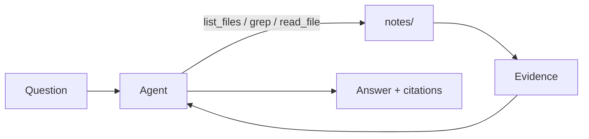

# Agentic RAG vs. Semantic RAG

For the past few years, whenever we wanted to give an LLM extra context, the default answer was RAG. In practice, that usually meant semantic search: chunk the source material, embed it, store it in a vector database, retrieve the most relevant chunks, and place those chunks in the prompt.

**That pattern is still useful, but it is no longer the only default.** A newer pattern is Agentic RAG where you give the model tools that let it search the source files directly, decide what to read next, follow clues across documents, and answer only when it has enough evidence.

Most developers have seen this shift inside coding agents like Cursor, Claude Code, and Codex. **The bigger opportunity is applying the same idea outside coding tools.** When engineers build AI automations and knowledge systems, they often still reach for Semantic RAG by default. This tutorial shows how to apply Agentic RAG to your own projects using plain Python.

This tutorial compares Agentic RAG and Semantic RAG, then builds an Agentic RAG system in Python with three tools over markdown notes: `list_files`, `grep`, and `read_file`.

## Table of contents

1. [`1-build-tools.py`](./1-build-tools.py). Build the three tools step by step.
2. [`2-import-tools.py`](./2-import-tools.py). Import the finished tools and see what each returns.
3. [`3-basic-agent.py`](./3-basic-agent.py). An agent that decides which tool to call next.
4. [`4-streaming-steps.py`](./4-streaming-steps.py). The same agent with visible intermediate steps.
5. [`5-structured-output.py`](./5-structured-output.py). A structured answer with citations.
6. [`6-production.py`](./6-production.py). The same tool interface with safer production defaults.

Background docs live in [`docs/`](./docs/): start with [`docs/agentic-rag-vs-semantic-rag.md`](./docs/agentic-rag-vs-semantic-rag.md), then use [`docs/python-patterns.md`](./docs/python-patterns.md) as a Python reference while reading the code.

## The loop



**The important part is the loop.** The model can inspect what files exist, search for promising lines, read the right documents, and then combine evidence across files.

## How the tools work

`list_files(pattern="*.md")` is the discovery tool. It uses `Path.glob()` to show the agent which markdown files exist, then returns paths relative to the `notes/` folder.

`grep(pattern, max_results=30)` is the narrowing tool. In the teaching version, it loops through markdown files with Python regex and returns matches as `file:line: text`. This gives the agent exact places to investigate next.

`read_file(path)` is the evidence tool. It resolves the requested path inside `notes/` and returns the full markdown file. The agent usually greps first, then reads the few files that look relevant.

In [`6-production.py`](./6-production.py), the names stay the same but the implementation gets stricter:

- `_safe_path()` resolves a user-provided path and rejects anything outside `notes/`.
- `grep()` calls `ripgrep` through `subprocess.run([...])`, with a fixed command list, a timeout, and agent-readable error messages. Three flags worth calling out: `--sortr=modified` puts recently edited files first (the same default Codex, OpenCode, and Cursor CLI use), `--no-config` ignores any `~/.ripgreprc` so behavior is identical on every machine, and an optional `context` parameter maps to `rg -C` so the model gets surrounding lines without a follow-up `read_file`.
- `list_files()` resolves glob matches before returning them, so a broad or weird pattern cannot escape the notes directory.
- `read_file()` adds `offset` and `limit`, so the agent can read a bounded line range instead of pulling an entire file into context.
- `SearchAnswer` and `Citation` make the final answer validate as structured data.
- `UsageLimits(request_limit=...)` caps how many turns the loop can take. A bad regex or a model that will not stop searching hits the cap and raises `UsageLimitExceeded` instead of running up cost forever.

The `subprocess` part is worth understanding. **Python starts another program, `rg`, and passes each argument as one item in a list.** We do not ask a shell to interpret a string command. The model supplies the regex pattern, but Python controls the binary, flags, working directory, timeout, and output handling.

## Production best practices

The version in [`6-production.py`](./6-production.py) encodes a small set of patterns that show up across most real coding agents (Claude Code, Codex, OpenCode, Cursor CLI, Pi, Gemini CLI).

- **Bound every tool output.** `max_results`, `READ_MAX_LINES`, and `GREP_TIMEOUT_SECONDS` cap result count, line count, and wall time. Pi caps grep at both 100 matches and 50KB; Cursor CLI uses a streaming line cap, a hard cutoff, and a buffer cap. The exact numbers matter less than having both a count cap and a byte or time cap.
- **Sort search results by mtime.** `--sortr=modified` puts recently edited files first. Codex, OpenCode, KiloCode, and Cursor CLI all default to this. In an active session, the file you touched five minutes ago is usually the one you want again.
- **Make tool behavior deterministic.** `--no-config` ignores any `~/.ripgreprc` so the agent behaves the same on every machine. Boring, important, almost always missing in toy implementations.
- **Return errors as strings, not exceptions.** Tools return `Error: ...` or `No matches ...` as plain strings the model can read. Raising would stop the loop; the agent should recover from a bad regex the same way it recovers from a missing file.
- **Let the model ask for surrounding context.** Optional `context` on `grep` maps to `rg -C` so the model can pull a few lines around each match inline instead of firing a follow-up `read_file`. Gemini CLI's source notes this kind of inline context cuts SWEBench turn count by about 10%.
- **Sandbox the filesystem boundary.** `_safe_path()` resolves the requested path and rejects anything outside `notes/`. The model supplies the path; Python decides whether the path is allowed.
- **Cap the loop.** `UsageLimits(request_limit=20)` prevents a runaway agent. Claude Code calls this `max_turns` and recommends it as a default for any production deployment.
- **Validate the answer shape.** `SearchAnswer` and `Citation` are Pydantic models so downstream code can trust the structure rather than parsing prose.

### What this tutorial does not cover

The Agentic RAG loop is one layer of a real agent harness. A full production setup adds more around it: token and dollar budget caps, sub-agents for context isolation, automatic context compaction when the window fills, `PreToolUse` and `PostToolUse` hooks, permission modes for sensitive actions, OS-level sandboxing (containers, gVisor, Firecracker), state persistence across sessions (the Ralph loop pattern), and a separate evaluator agent that grades work against testable criteria.

For that layer, see [Anthropic's harness design post](https://www.anthropic.com/engineering/harness-design-long-running-apps), [LangChain's anatomy of an agent harness](https://blog.langchain.com/the-anatomy-of-an-agent-harness/), and the [wasnotwas grep-across-agents comparison](https://wasnotwas.com/writing/grep-across-agents/).

## Setup

```bash
uv sync
cp .env.example .env

uv run 1-build-tools.py
uv run 2-import-tools.py
uv run 3-basic-agent.py
uv run 4-streaming-steps.py
uv run 5-structured-output.py
uv run 6-production.py
```

`6-production.py` also needs `rg` on your PATH. `rg` is the binary for [`ripgrep`](https://github.com/BurntSushi/ripgrep), a Rust-based search tool that is fast, cross-platform, recursive by default, and skips ignored, hidden, and binary files unless you tell it otherwise. That makes it a better production default than our teaching-only Python loop.

```bash
# macOS
brew install ripgrep

# Ubuntu / Debian
sudo apt-get install ripgrep
```

```powershell
# Windows
winget install BurntSushi.ripgrep.MSVC

# Alternatives
choco install ripgrep
scoop install ripgrep
```

## Resources

- [Building Claude Code with Boris Cherny](https://newsletter.pragmaticengineer.com/p/building-claude-code-with-boris-cherny)
- [Cursor: improving semantic search](https://cursor.com/blog/semsearch)
- [Pydantic AI documentation](https://ai.pydantic.dev/)

## FAQ

### Does this only work with local markdown files?

No. The tutorial uses local markdown because it makes the idea easy to see. **The production pattern is the tool interface, not the storage location.** Keep the same three actions: list what exists, search for candidate matches, and read the selected source. The backend can be a folder, mounted volume, database, object store, or search service.

### How would this work on a VPS?

On a VPS, the simplest setup is still a normal directory on disk. Put the files next to the app, sync them from another source, or mount a read-only content directory. Install `rg`, point `NOTES_DIR` at that directory, and keep the production safeguards from [`6-production.py`](./6-production.py): path validation, timeouts, bounded reads, and bounded search results.

### What about containers and container apps?

You have two common options. If the knowledge base changes with the app, bake it into the image. If it changes independently, mount it as storage. Docker supports read-only bind mounts and volumes ([Docker volumes](https://docs.docker.com/engine/storage/volumes/), [bind mounts](https://docs.docker.com/engine/storage/bind-mounts/)). Azure Container Apps can mount Azure Files for persistent content ([Azure Container Apps storage mounts](https://learn.microsoft.com/en-us/azure/container-apps/storage-mounts?tabs=smb)).

### What about serverless functions?

Serverless works, but you usually should not treat the function filesystem as the source of truth. Keep the knowledge base in S3, Azure Blob Storage, a database, or a mounted file service, then let the function list, search, and read through that backend. AWS Lambda has configurable temporary storage in `/tmp`, but it is still temporary execution storage, not a durable knowledge store ([AWS Lambda ephemeral storage](https://docs.aws.amazon.com/lambda/latest/dg/configuration-ephemeral-storage.html)).

### Can the markdown live in PostgreSQL?

Yes. Store each document as a row with fields like `path`, `title`, `content`, and `updated_at`. Then implement `list_files()` as a SQL query over paths, `grep()` as `ILIKE` or PostgreSQL full text search, and `read_file()` as a lookup by path or ID. For larger collections, use PostgreSQL full text search with a GIN index ([PostgreSQL full text search](https://www.postgresql.org/docs/current/textsearch.html)).

### Can this work with S3 or Azure Blob Storage?

Yes, but object storage is not a filesystem with built-in grep. For small collections, your tool can list objects, fetch candidate objects, and scan their text in Python. For larger collections, keep a small searchable index in PostgreSQL, OpenSearch, Azure AI Search, or another search layer, then read the original object from S3 or Blob Storage when the agent needs evidence. Azure AI Search can index markdown blobs directly ([Azure markdown blob indexing](https://learn.microsoft.com/en-us/azure/search/search-how-to-index-markdown-blobs)), and AWS has options for querying S3 data through OpenSearch ([OpenSearch direct query for S3](https://docs.aws.amazon.com/opensearch-service/latest/developerguide/direct-query-s3-overview.html)).

### Can I use files other than markdown?

Yes. The Agentic RAG loop only needs searchable text and stable citations. Plain text, JSON, YAML, logs, code, and CSV files can be searched directly. For PDF, DOCX, HTML, or slides, add an extraction step that converts the file to text first, then search that extracted text and cite the original file. Tools like [Docling](https://github.com/docling-project/docling) or [Markitdown](https://github.com/microsoft/markitdown/tree/main) are commonly used for this kind of text extraction.
