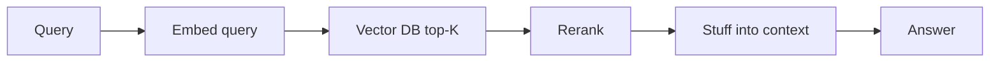
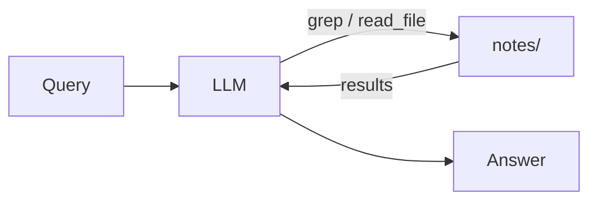

# Agentic RAG vs. Semantic RAG

RAG gives an LLM external knowledge at runtime: split your docs into chunks, embed them, store the embeddings in a vector database, retrieve the most relevant chunks for each query, then include those chunks in the prompt.

Modern coding agents don't work that way. **Claude Code, Cursor, Codex, and Aider don't pre-index your codebase as embeddings**. They give the agent a few simple tools (grep, glob, read) and let it search by exploring, the same way you would.

Boris Cherny, the creator of Claude Code, put it directly:

> Early versions of Claude Code used RAG + a local vector db, but we found pretty quickly that agentic search generally works better. It is also simpler and doesn't have the same issues around security, privacy, staleness, and reliability.

This document is the part of the tutorial where I explain *why* that shift happened, and where each approach still wins. The rest of the folder is the code.

## The two approaches, side by side

Semantic RAG is one-shot retrieval:

Agentic RAG is a loop:

## How they compare

| Dimension | Semantic RAG | Agentic RAG |
| --- | --- | --- |
| Typical latency | Under 2s | 5 to 15s |
| Token cost | Low | 3 to 10x higher |
| Multi-hop questions | Often misses | Chases references naturally |
| Freshness | Snapshot index, must rebuild on writes | Always live (filesystem is the source of truth) |
| Code, exact symbols | Embeddings struggle | Grep is exact |
| Fuzzy semantic queries | Strong, finds matches across different wording | Weak, has to guess keywords |
| Determinism | Same top-K each time | Varies with the agent's decisions |
| Transparency | Black-box similarity scores | Every grep and read is visible |
| Privacy | Index lives in a vector DB | Nothing leaves disk unless the agent reads it |

## A practical rule of thumb

| You're searching... | Try first | Why |
| --- | --- | --- |
| Code, configs, runbooks, structured docs | Agentic RAG | Exact symbols and identifiers matter |
| FAQs, customer-support tickets, marketing content | Semantic RAG | Phrasing varies; semantic match wins |
| Internal wiki, engineering knowledge base | Agentic RAG | Exact terms, multi-hop questions |
| Books, papers, long-form articles | Semantic RAG | Semantic similarity matters more than exact match |
| "What was the decision we made about X?" | Agentic RAG | The agent can chase references between docs |
| "Show me anything similar to this user's complaint" | Semantic RAG | Vector similarity is the whole point |

## Where these recommendations come from

The shift toward Agentic RAG for code is reflected in how every major coding agent works in 2026, and there are public numbers to back it up.

- **Claude Code dropped RAG entirely.** Boris Cherny, the creator: *"Early versions of Claude Code used RAG + a local vector db, but we found pretty quickly that agentic search generally works better."* Source: [Pragmatic Engineer interview](https://newsletter.pragmaticengineer.com/p/building-claude-code-with-boris-cherny).
- **Cursor uses a hybrid and measured the lift.** Their A/B testing: adding semantic search alongside grep gives roughly +12.5% accuracy on code Q&A (the exact lift varies 6.5% to 23.5% by model), and +2.6% code retention on repos over 1,000 files. Their conclusion: *"our agent makes heavy use of grep as well as semantic search, and the combination of these two leads to the best outcomes."* Source: [Cursor: improving semantic search](https://cursor.com/blog/semsearch).
- **Aider uses a third path.** It builds a repo map via tree-sitter and ranks files with PageRank on the symbol-reference graph, then hands the top-ranked snippets to the model. Pure structural analysis, no embeddings. Source: [Aider repomap](https://aider.chat/docs/repomap.html).
- **The token cost is real.** Agentic RAG runs roughly 3 to 10 times more tokens than vanilla RAG. ReAct-style document retrieval clusters at 4 to 8x cost and 3 to 5x latency. Multi-hop decomposition can hit 5 to 10x cost and 3 to 6x latency. Source: [Agentic RAG 2026 guide](https://www.marsdevs.com/guides/agentic-rag-2026-guide).
- **For prose corpora, RAG with rerank is still the move.** Two-stage retrieval (vector search, then a cross-encoder reranker like Cohere Rerank or BGE) lifts Recall@5 from around 0.69 to 0.82, a 17% jump that propagates through everything downstream.
- **Counterpoint worth reading.** Not everyone agrees the cost tradeoff is worth it. The argument against is that grep loops burn tokens proportional to repo size and miss semantic matches (queries like "auth logic" against documents that don't literally contain the word "auth"). Source: [Why I'm against Claude Code's grep-only retrieval](https://milvus.io/blog/why-im-against-claude-codes-grep-only-retrieval-it-just-burns-too-many-tokens.md).

## The big lesson

**Stop reaching for a vector database by default.** For many of the cases that show up in real production systems, especially anything code- or runbook-shaped, Agentic RAG with grep is simpler, fresher, and more honest about what it found.
