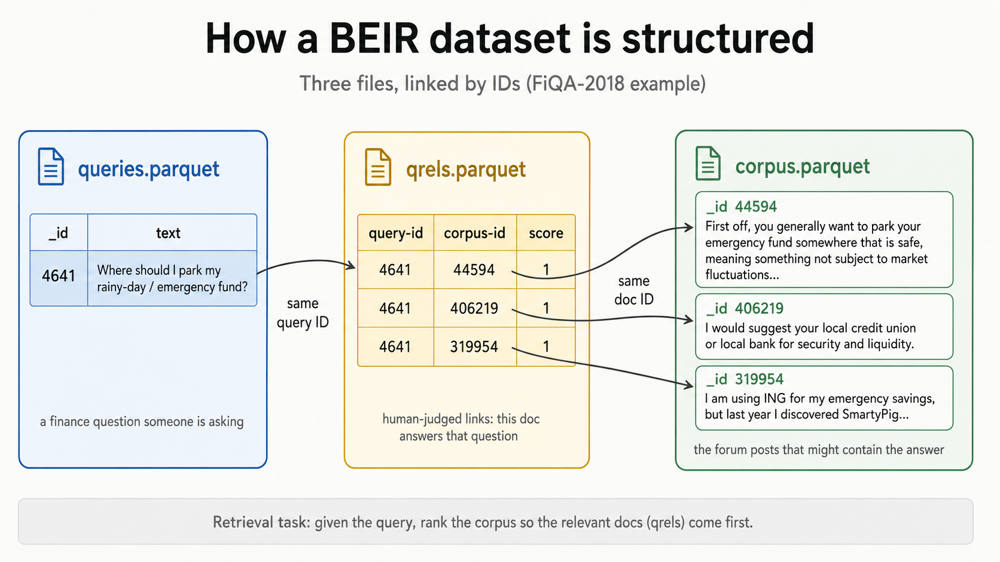
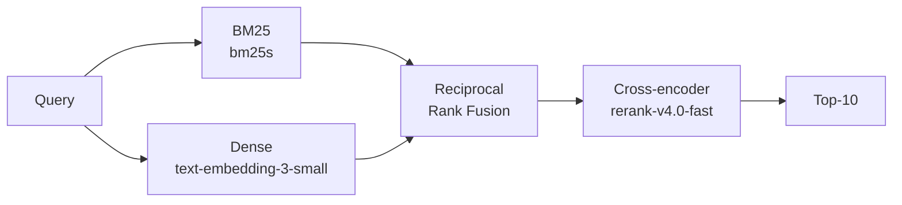

# Building Hybrid Retrieval From Scratch (BM25 + Dense + Reranker)

The previous tutorial, [`knowledge/agentic-rag`](../agentic-rag/), made the case for ditching the vector database entirely and letting an agent grep the source files. That works well when your corpus is code, runbooks, or anything where exact symbols matter. **It does not work well when the queries paraphrase the documents.** "Auth logic" against a corpus that says "authentication middleware" is the canonical failure mode.

This tutorial covers the production retrieval stack you reach for when you do want an index. The plain hybrid baseline that wins on public benchmarks in 2026: **BM25 for keyword matching, dense embeddings for paraphrase, Reciprocal Rank Fusion to combine them, and a cross-encoder reranker on the top-50 candidates.**

We build it on [FiQA-2018](https://sites.google.com/view/fiqa), a financial Q&A benchmark with 57,638 forum posts and 648 labeled test questions. Mentally substitute your own corpus: help center articles, internal wiki pages, sales playbook, support tickets. The retrieval mechanics are identical. FiQA is here because it has labeled ground truth, so we can compute honest NDCG@10 instead of squinting at example queries.



## The stack



Four stages, four jobs:

1. **BM25** is sparse retrieval. It scores by keyword overlap with TF-IDF style weighting. Catches exact terms, identifiers, rare words. Misses paraphrase.
2. **Dense embeddings** is the inverse. The same query and a paraphrased document end up close in vector space even with zero shared words. Misses exact symbols and rare terms.
3. **RRF** fuses the two rankings. The trick: combine ranks, not scores. BM25 scores are unbounded, cosine similarities are in [0, 1], and naive averaging breaks. RRF sidesteps the whole problem.
4. **The reranker** is a cross-encoder. The bi-encoder dense retriever embeds query and document separately; a cross-encoder feeds both into one model and returns a relevance score with full joint attention. Slower per call, much higher accuracy. So we run it only on the top-50 candidates.

## Table of contents

1. [`1-explore-data.py`](./1-explore-data.py). Load FiQA, look at a doc, a query, and a qrel.
2. [`2-bm25.py`](./2-bm25.py). Build, persist, and query a BM25 index with `bm25s`.
3. [`3-embed.py`](./3-embed.py). Embed the corpus with `text-embedding-3-small` and search by cosine.
4. [`4-rrf.py`](./4-rrf.py). Reciprocal Rank Fusion in ten lines of Python.
5. [`5-rerank.py`](./5-rerank.py). Cohere `rerank-v4.0-fast` on the top-50 hybrid candidates.
6. [`6-evaluate.py`](./6-evaluate.py). NDCG@10 for all four stages on the FiQA test set.

The [`utils/`](./utils/) folder holds the cleaned-up helpers that files 4 through 6 import from. [`utils/retrievers.py`](./utils/retrievers.py) wraps BM25 and dense retrieval, [`utils/fusion.py`](./utils/fusion.py) wraps RRF, and [`utils/reranker.py`](./utils/reranker.py) wraps the Cohere cross-encoder call. The numbered files build each concept inline first so you see the construction on screen, then later files import the polished version instead of redefining it.

## Why each piece earns its place

The four-stage pipeline looks like overkill until you watch each stage fail on its own.

**BM25 alone** wins when the query and document share rare terms ("1099-MISC", "EBITDA", "Roth 401(k)", a specific ticker symbol, a customer ID). It collapses when the query paraphrases. Try BM25 on `Where should I park my rainy-day fund?` against documents that talk about emergency savings and high-yield accounts: zero word overlap, zero recall.

**Dense alone** wins exactly where BM25 loses, and loses exactly where BM25 wins. Embeddings smooth over phrasing but they also smooth over precision. A query for the exact tax form `1099-MISC` retrieves documents about freelance taxes in general before it retrieves the one that names the form. The rare-but-precise term gets diluted.

**Hybrid (RRF)** captures both wins. Cursor's public A/B testing on code retrieval found that adding semantic search alongside grep gives roughly +12.5% accuracy on code Q&A, varying from +6.5% to +23.5% by model ([Cursor: improving semantic search](https://cursor.com/blog/semsearch)). The combination is what production teams ship.

**The reranker** is the boring multiplier. A cross-encoder sees the query and document jointly, so it can reason about "does this passage actually support this claim?" in a way that two independent embeddings cannot. 

## Setup

```bash
# from the repo root
uv sync

# one-time FiQA download (~50 MB)
uv run knowledge/hybrid-retrieval/data/download_fiqa.py

# then walk the numbered files
uv run knowledge/hybrid-retrieval/1-explore-data.py
uv run knowledge/hybrid-retrieval/2-bm25.py
uv run knowledge/hybrid-retrieval/3-embed.py     # ~$0.22 of embeddings, cached after
uv run knowledge/hybrid-retrieval/4-rrf.py
uv run knowledge/hybrid-retrieval/5-rerank.py
uv run knowledge/hybrid-retrieval/6-evaluate.py
```

You need two API keys in `.env`:

- `OPENAI_API_KEY` for embeddings
- `COHERE_API_KEY` for the reranker. The trial tier gives 1,000 free calls a month ([Cohere trial pricing](https://docs.cohere.com/docs/rate-limits))

## Where these recommendations come from

- **`bm25s` over `rank_bm25`.** The `bm25s` benchmark reports ~500x speedup over `rank_bm25` while staying pure Python and pip-installable ([bm25s GitHub](https://github.com/xhluca/bm25s)). For a tutorial corpus you would not notice, but the persistence story (`save` / `load` with the corpus, optional memory mapping) is materially cleaner.
- **`text-embedding-3-small` as the default.** OpenAI's announcement reports 62.3 on MTEB for `text-embedding-3-small` versus 64.6 for `text-embedding-3-large`, at roughly 6.5x lower cost ($0.02 vs $0.13 per 1M tokens) ([OpenAI: new embedding models](https://openai.com/index/new-embedding-models-and-api-updates/)). For a tutorial baseline that gets fused with BM25 and reranked anyway, a 2-point MTEB gap is well within the noise that the rest of the pipeline contributes. Spend the optimization budget on retrieval design, not on a marginally better embedding model.
- **RRF with k=60.** The 2009 paper that introduced it called it "simple but effective" and twelve years of follow-up work have not unseated it ([Cormack et al., SIGIR 2009](https://plg.uwaterloo.ca/~gvcormac/cormacksigir09-rrf.pdf)). Newer "learned" fusion methods exist but require training data the tutorial doesn't need.
- **Cohere `rerank-v4.0-fast` over alternatives.** Top of public reranker benchmarks in 2026, generous free tier, single API call, no model to host ([Cohere Rerank docs](https://docs.cohere.com/docs/rerank-overview)). The open-weight alternative I would mention to viewers who want to ship offline is BGE Reranker v2-m3 ([BGE Reranker on HF](https://huggingface.co/BAAI/bge-reranker-v2-m3)).
- **The four-stage pipeline order.** "Start with hybrid retrieval, not dense-only. The extra complexity is worth it; you'll end up adding BM25 later anyway after the first major hallucination incident" ([Supermemory hybrid search guide, April 2026](https://supermemory.ai/blog/hybrid-search-guide/)).

## FAQ

### Why the FiQA dataset?

FiQA is a published benchmark with real qrels, so you can compute honest NDCG@10 and compare against public numbers. Your own data would be more relatable but you would have no ground truth, so you would be measuring vibes. **For learning the pipeline, you want hard numbers.** Once you trust the pipeline, point it at your own data. A natural follow-up is generating synthetic queries against your real corpus and using LLM-as-judge for relevance, which is how production teams actually build evals.

### Why not a vector database?

A vector database is a deployment concern, not a retrieval concern. The retrieval pattern in this tutorial (BM25 + dense + RRF + rerank) is what runs on top of one. For small corpora, numpy on a single embeddings matrix is faster than going through any vector DB. Once you outgrow that, swap the dot-product step for Qdrant, LanceDB, or pgvector. The rest of the pipeline does not change.

### Can I use a local reranker instead of Cohere?

Yes. [`BAAI/bge-reranker-v2-m3`](https://huggingface.co/BAAI/bge-reranker-v2-m3) is the strongest open-weight option, ~568 MB, runs on CPU for tutorial-sized corpora. Latency is meaningfully higher than an API call, which is why the tutorial defaults to Cohere. The swap is a one-function change in [`5-rerank.py`](./5-rerank.py).

### Can I chunk longer documents than FiQA posts?

FiQA forum posts are short (median ~100 words, all under the 8,191-token embedding input cap), so chunking is a no-op here. For longer documents like help center articles or PDF pages, a reasonable starting point is a semantic splitter with a chunk size around 512 tokens and ~10-20% overlap. Tune from there based on your corpus; chunking is workload-dependent and there is no universal best value.

## Apply this to your own project

The mechanics generalize. Replace FiQA with your help center, internal wiki, sales playbook, support tickets, regulatory filings, whatever your corpus is. The pipeline does not change. Walk through these steps in order.

1. **Define and collect your corpus.** Figure out what set of documents the retrieval needs to cover. Pull them out of whatever system they live in (Notion, Zendesk, S3, a database) and write them to a single file or folder. Keep a stable `_id` per document, you will need it everywhere.

2. **Decide whether to chunk.** Look at the document length distribution. Chunking is **required** when a single document exceeds the embedding model's max input (8,191 tokens for `text-embedding-3-small`, ~6,000 words of English). It is **also worth doing** even within the limit when documents are long enough that a single vector cannot meaningfully summarize them, typically anything over ~1,000 tokens. If your docs are short like FiQA posts or short tickets, skip chunking entirely. If you do chunk, use a **semantic splitter** that respects sentence and paragraph boundaries (libraries like `semantic-text-splitter` or `docling`) rather than a naive fixed-size split that cuts mid-sentence. A reasonable starting point is ~512 tokens with 10-20% overlap, then tune.

3. **Pick an embedding model.** `text-embedding-3-small` is the sensible default (see the rationale in the section above). Consider `text-embedding-3-large` if your corpus is multilingual or technical jargon-heavy and the cost is fine. Consider a local model like `BAAI/bge-large-en-v1.5` if you can't ship API calls.

4. **Build the BM25 index.** Tokenize the corpus once, build the index with `bm25s`, persist it to disk. This is [`2-bm25.py`](./2-bm25.py) with your text instead of FiQA's.

5. **Embed and store.** Embed the corpus once with the model from step 3, save the resulting matrix. For small to medium corpora (under ~5M chunks), a numpy `.npy` file is faster and simpler than any vector database. Above that, or if you need multi-tenant filtering and updates, swap in Qdrant, LanceDB, or pgvector. The retrieval pattern does not change.

6. **Wire up retrieval.** Copy the helper modules in [`utils/`](./utils/) into your project as a starting point. `BM25Retriever`, `DenseRetriever`, `reciprocal_rank_fusion`, and `rerank_with_cohere` are all you need to recreate the four-stage pipeline. Wrap them in a `search_hybrid(query, k=10)` function that fetches `candidate_k=50` from each retriever, fuses with RRF, reranks the top 50, and returns the top 10.

7. **Build an evaluation set on your own data.** Without ground truth, you cannot tell whether your pipeline is good or which knob actually moves the needle. The cheapest path is to **let an LLM generate queries against your real documents**, then evaluate every retrieval variant against that synthetic eval set. Recipe in [`docs/build-your-own-eval.md`](./docs/build-your-own-eval.md).

Once steps 1 to 6 are wired up and step 7 gives you a feedback loop, the rest is iteration. Swap an embedding model, change chunk size, tune `candidate_k`, try a different reranker, and watch NDCG@10 move. That's the whole job.
