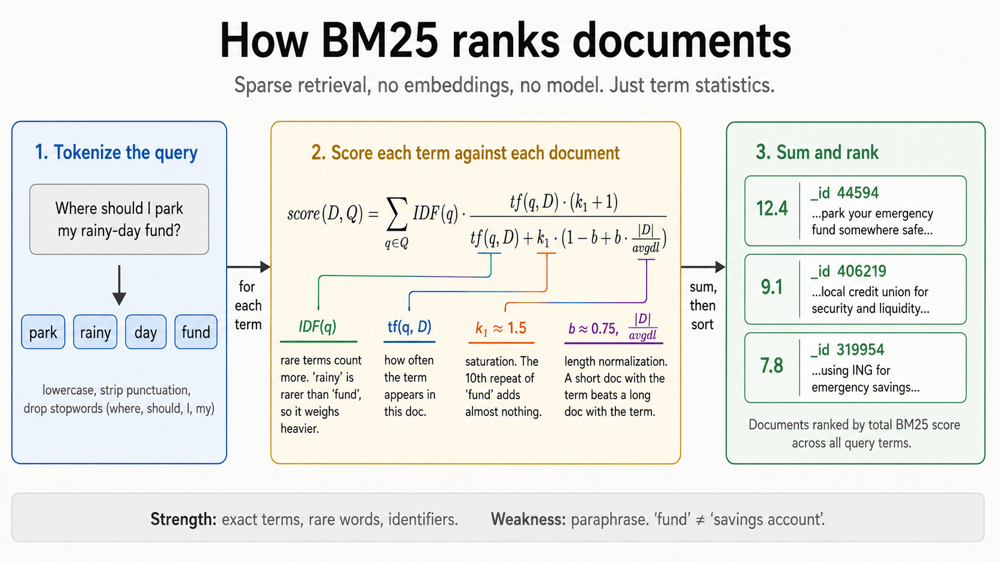

# How BM25 works (and how `bm25s` actually does it)

BM25 has been the boring-but-strong baseline in information retrieval since the 90s. It still beats most fancy approaches on keyword-heavy queries, and it costs nothing to run. This doc is the minimum mental model you need to read [`2-bm25.py`](../2-bm25.py) and not feel like the library is magic.

## The intuition in one sentence

> BM25 ranks a document higher when it contains the query's words, gives more credit to rare words, and penalizes documents that pad those words inside a lot of unrelated text.

That's it. Everything below is just making that sentence precise.

## The formula



For a query $Q$ made of terms $q_1, q_2, \ldots$ and a document $D$:

$$
\text{score}(D, Q) = \sum_{q \in Q} \text{IDF}(q) \cdot \frac{\text{tf}(q, D) \cdot (k_1 + 1)}{\text{tf}(q, D) + k_1 \cdot \left(1 - b + b \cdot \frac{|D|}{\text{avgdl}}\right)}
$$

Four moving parts. That's all you need to remember.

| Symbol           | What it means                                       | Intuition                                                                   |
| ---------------- | --------------------------------------------------- | --------------------------------------------------------------------------- |
| $\text{tf}(q,D)$ | How often term $q$ appears in document $D$          | More mentions means more relevant, but with diminishing returns.            |
| $\text{IDF}(q)$  | Inverse document frequency of $q$ across the corpus | Rare terms count more. "rainy" beats "fund" beats "the".                    |
| $k_1 \approx 1.5$ | Term frequency saturation                          | Caps the reward for repeating a word. The 10th mention adds almost nothing. |
| $b \approx 0.75$ | Length normalization strength                       | A short doc with the term beats a long doc with the same term.              |
| $\|D\| / \text{avgdl}$ | This doc's length compared to the corpus average | Used by $b$ to do the normalization.                                        |

The defaults $k_1 = 1.5$ and $b = 0.75$ come from the original BM25 paper and have held up well enough that most libraries ship them as defaults. Tune them only if you have a good reason and a held-out eval set.

IDF, expanded:

$$
\text{IDF}(q) = \ln\!\left( \frac{N - n(q) + 0.5}{n(q) + 0.5} + 1 \right)
$$

where $N$ is the total number of documents and $n(q)$ is the number of documents containing $q$. The shape is what matters: a term that appears in 1% of docs gets a much higher weight than one that appears in 50%.

## What `bm25s` is actually doing under the hood

The library is small and the data flow is simple. Three phases.

### Phase 1: tokenize

```python
tokens = bm25s.tokenize(doc_texts, stopwords="en")
```

This splits each doc into words, lowercases, strips punctuation, drops English stopwords ("the", "is", "and", and so on), and assigns each surviving unique word an integer ID.

The return value is a `Tokenized` NamedTuple with two fields:

- `tokens.ids`: `list[list[int]]`. One inner list per document. Each inner list is the document rewritten as a sequence of integer token IDs, in order of appearance.
- `tokens.vocab`: `dict[str, int]`. The lookup table from token string to integer ID. Stable across the whole corpus.

Concretely, after tokenizing 3 FiQA posts you might see:

```
tokens.ids[0]  = [0, 1, 2, 3, 4, 5, 6, 7, 8, 9, ...]
tokens.ids[1]  = [41, 42, 43, 44, 45, 46, 47, 48, 49, 50, ...]
tokens.vocab   = {'saying': 0, 'don': 1, 'like': 2, 'idea': 3, 'job': 4, ...}
```

Token ID `7` means the string `"you"` no matter which document it appears in. This integer encoding is purely a performance trick: BM25 scoring runs over numpy int arrays, not Python strings.

### Phase 2: build the inverted index

```python
retriever = bm25s.BM25()
retriever.index(tokens)
```

The index is a classic **inverted index**: for every term ID, a list of which documents contain it and how many times. Roughly:

```
term_id 7 ("you")       -> [(doc_0, 3), (doc_2, 1), (doc_7, 5), ...]
term_id 847 ("emergency") -> [(doc_44594, 4), (doc_406219, 1), ...]
```

This is the data structure that makes BM25 fast. To score a query, you only look at documents that contain at least one query term. With 57k docs and a 4-term query, that's typically a few thousand candidates instead of all 57,638.

`bm25s` stores the index as a sparse matrix internally (scipy CSC format), which is why it can be ~500x faster than the older `rank_bm25` package that uses plain Python loops. The paper write-up has the details if you care: [arxiv.org/abs/2407.03618](https://arxiv.org/abs/2407.03618).

### Phase 3: retrieve

```python
query_tokens = bm25s.tokenize([query], stopwords="en")
indices, scores = retriever.retrieve(query_tokens, k=10)
```

At query time:

1. Tokenize the query through the same vocab (unknown query words just get dropped).
2. For each query term, pull its posting list from the inverted index.
3. Compute the BM25 score for each candidate doc using the formula above.
4. Sort by score, return the top-k.

The output is two numpy arrays: `indices[0]` is the integer positions of the top docs (which you map back to your own doc IDs), and `scores[0]` is the matching BM25 scores.

## When BM25 is great, when it isn't

**Great at:** exact terms, rare words, identifiers, acronyms, code symbols, anything where the user's vocabulary matches the document's vocabulary.

**Bad at:** paraphrase. "auth logic" against a doc that says "authentication middleware" scores zero. The query word `fund` does not match the doc word `savings account`. This is the gap that dense embeddings close in [`3-embed.py`](../3-embed.py), and why we fuse the two with RRF.

## Further reading

- Original BM25 paper: Robertson & Walker, *Some Simple Effective Approximations to the 2-Poisson Model for Probabilistic Weighted Retrieval* (1994). [PDF](https://www.staff.city.ac.uk/~sbrp622/papers/foundations_bm25_review.pdf) of the foundations review by Robertson & Zaragoza is the cleanest modern write-up.
- `bm25s` library: [github.com/xhluca/bm25s](https://github.com/xhluca/bm25s)
- Elastic's plain-English explainer: [elastic.co/blog/practical-bm25-part-2-the-bm25-algorithm-and-its-variables](https://www.elastic.co/blog/practical-bm25-part-2-the-bm25-algorithm-and-its-variables)
