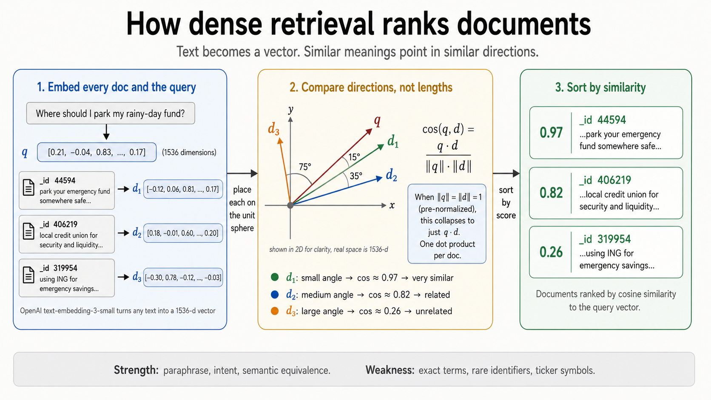

# How dense retrieval works (and how we do similarity search in numpy)

Dense retrieval is the half of the hybrid stack that BM25 can't do: matching meaning when the words don't overlap. "Park my emergency fund" should rank a document that says "safe place for short-term savings" near the top, even though zero query words appear in it. This doc is the minimum mental model you need to read [`3-embed.py`](../3-embed.py).

## The intuition in one sentence

> An embedding turns a piece of text into a vector. Texts that mean similar things point in similar directions. Retrieval is just finding the document vectors whose direction is closest to the query vector's.

That's it. Everything below is just making that sentence precise.

## The formula



Given a query vector $\mathbf{q}$ and a document vector $\mathbf{d}$ (both produced by the same embedding model), we rank by **cosine similarity**:

$$
\text{cos}(\mathbf{q}, \mathbf{d}) = \frac{\mathbf{q} \cdot \mathbf{d}}{\|\mathbf{q}\| \cdot \|\mathbf{d}\|}
$$

It's exactly the cosine of the angle between the two vectors in their high-dimensional space:

- $\cos = 1$ means the vectors point in the same direction (most similar).
- $\cos = 0$ means they're perpendicular (unrelated).
- $\cos = -1$ means they point in opposite directions (opposite meaning, rare in practice with modern embedding models).

| Symbol                  | What it means                                                |
| ----------------------- | ------------------------------------------------------------ |
| $\mathbf{q}, \mathbf{d}$ | The query and document embedding vectors (e.g. 1536-d for `text-embedding-3-small`). |
| $\mathbf{q} \cdot \mathbf{d}$ | Dot product: $\sum_i q_i \cdot d_i$. Cheap to compute. |
| $\|\mathbf{q}\|$        | The vector's length (L2 norm): $\sqrt{\sum_i q_i^2}$.       |

## The unit-vector trick

If every vector is **pre-normalized to length 1** (i.e. $\|\mathbf{v}\| = 1$), the denominator becomes $1$ and cosine similarity collapses to a plain dot product:

$$
\text{cos}(\mathbf{q}, \mathbf{d}) = \mathbf{q} \cdot \mathbf{d} \quad \text{(when both vectors are unit length)}
$$

That's why [`3-embed.py`](../3-embed.py) normalizes the corpus matrix once at index time:

```python
doc_embeddings_normed = doc_embeddings / np.linalg.norm(doc_embeddings, axis=1, keepdims=True)
```

And every query at query time:

```python
query_vec /= np.linalg.norm(query_vec)
```

Once both are unit vectors, scoring the entire corpus is a **single matrix-vector product**:

```python
scores = doc_embeddings_normed @ query_vec   # shape: (N,)
```

That's it. No special library, no vector database. For tutorial-sized corpora (under a few million docs), numpy is faster than going through any vector DB because there's no network hop and no index overhead. You only need a vector DB when the matrix no longer fits in RAM or you need filtered/hybrid queries handled by the engine.

## What `3-embed.py` is actually doing

Three phases.

### Phase 1: embed the corpus once

```python
def embed_batch(texts: list[str]) -> np.ndarray:
    response = client.embeddings.create(model="text-embedding-3-small", input=texts)
    return np.array([d.embedding for d in response.data], dtype=np.float32)
```

Each call to the OpenAI embeddings endpoint accepts a batch of up to ~2048 inputs and returns a list of 1536-d float vectors. We send the FiQA corpus in batches of 256 (a balance between throughput and request size), stack the results into a single `(57638, 1536)` numpy array, and save it to disk.

This is the slow, expensive step. You pay for it once. At ~$0.02 per 1M tokens for `text-embedding-3-small`, embedding the full FiQA corpus costs about $0.22. After that, every query is free and runs in milliseconds.

### Phase 2: normalize so cosine = dot product

```python
doc_embeddings_normed = doc_embeddings / np.linalg.norm(doc_embeddings, axis=1, keepdims=True)
```

Divide each row by its own L2 norm. Now every doc vector has length 1, and they all lie on the unit hypersphere. The geometric meaning is preserved (relative directions are unchanged), but scoring becomes one dot product instead of a dot product plus two norm computations and a division.

### Phase 3: query

```python
query_vec = embed_batch([query])[0]
query_vec /= np.linalg.norm(query_vec)
scores = doc_embeddings_normed @ query_vec
top_k = np.argsort(-scores)[:k]
```

Four lines. Embed the query, normalize it, dot-product against the entire corpus matrix, sort by descending score, take the top-k. The matrix-vector product is the only meaningful work, and numpy's BLAS backend runs it on all CPU cores in parallel.

## When dense is great, when it isn't

**Great at:** paraphrase, intent matching, multilingual when the model is multilingual, anything where the query and the document use *different words to say the same thing*. This is precisely BM25's weakness.

**Bad at:** exact terms, rare identifiers, ticker symbols, regulation names, error codes, function names. The embedding will quietly drift toward "general semantic neighborhood" and rank a doc that talks about *similar* things above the one that contains the exact term you typed. This is precisely BM25's strength. Which is why we fuse the two with RRF in [`4-rrf.py`](../4-rrf.py).

## Other distance metrics you'll see

| Metric              | Formula                                       | When to use                                                    |
| ------------------- | --------------------------------------------- | -------------------------------------------------------------- |
| Cosine similarity   | $\mathbf{q} \cdot \mathbf{d} / (\|\mathbf{q}\| \|\mathbf{d}\|)$ | Default for most text embedding models, including OpenAI.    |
| Dot product (raw)   | $\mathbf{q} \cdot \mathbf{d}$                 | Same as cosine **only if both vectors are unit length**.       |
| Euclidean distance  | $\|\mathbf{q} - \mathbf{d}\|_2$               | Rare in retrieval. Sensitive to magnitude, not just direction. |

OpenAI's embeddings are already L2-normalized by the API (each vector has $\|\mathbf{v}\| = 1$ on return), so technically you could skip the normalization step in [`3-embed.py`](../3-embed.py). We re-normalize anyway as a defensive habit; it costs nothing and protects against models that don't ship pre-normalized vectors.

## Further reading

- OpenAI embeddings guide: [platform.openai.com/docs/guides/embeddings](https://platform.openai.com/docs/guides/embeddings)
- Reimers & Gurevych, *Sentence-BERT* (2019). The paper that popularized using transformer encoders for retrieval: [arxiv.org/abs/1908.10084](https://arxiv.org/abs/1908.10084)
- MTEB benchmark, for picking an embedding model: [huggingface.co/spaces/mteb/leaderboard](https://huggingface.co/spaces/mteb/leaderboard)
