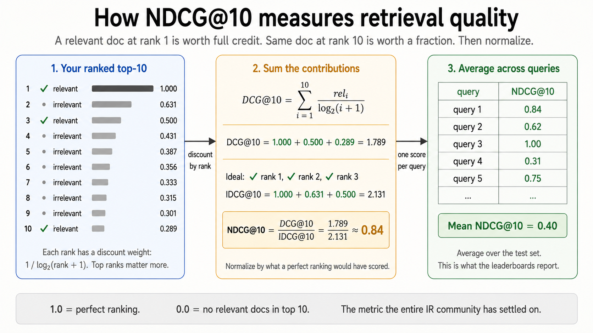

# Normalized Discounted Cumulative Gain at 10 (NDCG@10)

You can't say one retriever is better than another by squinting at example queries. You need a metric that rewards putting relevant docs near the top and penalizes putting them near the bottom. **NDCG@10** is the metric the entire IR community has settled on. This doc is the minimum mental model you need to read [`6-evaluate.py`](../6-evaluate.py).

## The intuition in one sentence

> A relevant document at rank 1 is worth its full relevance score. A relevant document at rank 10 is worth a fraction of it. NDCG@10 sums those discounted contributions and divides by what a perfect ranking would have scored.

That's it. Position matters, and the metric is normalized so a perfect ranking always scores 1.0.

## The formula



**DCG@k** (Discounted Cumulative Gain at $k$) for a single query, with relevance scores $\text{rel}_i$ at rank $i$:

$$
\text{DCG@}k = \sum_{i=1}^{k} \frac{\text{rel}_i}{\log_2(i + 1)}
$$

The discount $1 / \log_2(i + 1)$ shrinks as $i$ grows:

| Rank $i$ | Discount $1 / \log_2(i+1)$ |
| -------- | -------------------------- |
| 1        | $1.000$                    |
| 2        | $0.631$                    |
| 3        | $0.500$                    |
| 5        | $0.387$                    |
| 10       | $0.289$                    |

A relevant doc at rank 1 contributes the full $\text{rel}$. The same doc at rank 10 contributes only about 29% of it. That's the "position matters" part baked into the formula.

**IDCG@k** (Ideal DCG) is what you'd score if you placed every relevant document in the perfect order at the top. It's the maximum DCG@k achievable for this query.

**NDCG@k** normalizes:

$$
\text{NDCG@}k = \frac{\text{DCG@}k}{\text{IDCG@}k}
$$

NDCG@10 is in $[0, 1]$. $1.0$ = perfect ranking. $0$ = no relevant docs in the top 10.

## A worked example

Suppose a query has 3 relevant documents (each with binary relevance, $\text{rel} = 1$). Your retriever returns the top 10 with this relevance pattern:

| Rank $i$ | Doc relevant? | Contribution $\text{rel}_i / \log_2(i+1)$ |
| -------- | ------------- | ----------------------------------------- |
| 1        | yes           | $1 / 1.000 = 1.000$                       |
| 2        | no            | $0$                                       |
| 3        | yes           | $1 / 2.000 = 0.500$                       |
| 4        | no            | $0$                                       |
| 5–9      | no            | $0$                                       |
| 10       | yes           | $1 / 3.459 = 0.289$                       |

$$\text{DCG@}10 = 1.000 + 0.500 + 0.289 = 1.789$$

The ideal ranking puts all 3 relevant docs at ranks 1, 2, 3:

$$\text{IDCG@}10 = \frac{1}{\log_2 2} + \frac{1}{\log_2 3} + \frac{1}{\log_2 4} = 1.000 + 0.631 + 0.500 = 2.131$$

$$\text{NDCG@}10 = \frac{1.789}{2.131} \approx 0.84$$

A perfect ranking would have scored 1.0. The retriever caught all 3 relevant docs but missed putting them at the top, so it's 0.84.

## What `6-evaluate.py` is actually doing

The function is 7 lines:

```python
def ndcg_at_k(predicted_ids: list[str], relevant: dict[str, int], k: int = 10) -> float:
    dcg = sum(
        relevant.get(doc_id, 0) / math.log2(rank + 2)
        for rank, doc_id in enumerate(predicted_ids[:k])
    )
    ideal_rels = sorted(relevant.values(), reverse=True)[:k]
    idcg = sum(rel / math.log2(rank + 2) for rank, rel in enumerate(ideal_rels))
    return dcg / idcg if idcg > 0 else 0.0
```

Two things worth noting:

1. **`math.log2(rank + 2)`** is the same formula as $\log_2(i+1)$ above. The `+2` is because Python's `enumerate` returns 0-indexed positions, so $\text{rank}=0$ corresponds to $i=1$, giving $\log_2(0+2) = \log_2(2) = 1$. The math is identical.
2. **`relevant.get(doc_id, 0)`** treats any doc not in the qrels as having relevance 0. That handles the "irrelevant" case implicitly.

The script computes NDCG@10 for every method (BM25, dense, hybrid, hybrid + rerank) on each query in the sample, then averages. On FiQA you should see something close to:

| Method                | NDCG@10   |
| --------------------- | --------- |
| BM25                  | ~0.24     |
| Dense (`text-embedding-3-small`) | ~0.31  |
| Hybrid (RRF)          | ~0.35     |
| Hybrid + rerank       | ~0.40+    |

Public BEIR baselines land in those ranges. If your numbers are wildly off, something is wrong with the pipeline, not with NDCG.

## Why NDCG@10 and not something else

| Metric         | What it measures                                | Limitation                                                         |
| -------------- | ----------------------------------------------- | ------------------------------------------------------------------ |
| **Precision@k** | Fraction of top-k that are relevant.            | Ignores order *within* top-k. Treats "relevant at rank 1" and "relevant at rank 10" identically. |
| **Recall@k**    | Fraction of all relevant docs that are in top-k. | Same blind spot. Also depends on the total number of relevant docs, which varies wildly per query. |
| **MRR**         | $1 / \text{rank of first relevant doc}$.         | Only looks at the *first* relevant doc. If there are 5 relevant docs, finding 1 of them at rank 1 scores the same as finding all 5 at rank 1. |
| **MAP**         | Mean of average precisions across queries.       | Sensitive to recall, but assumes binary relevance (no graded scores). |
| **NDCG@k**      | Position-discounted, graded-relevance, normalized. | Slightly heavier to compute. Worth it.                           |

Why **@10** specifically: users rarely look past the first page of results, so the metric should focus on what they actually see. BEIR, MS MARCO, and most modern retrieval leaderboards all report NDCG@10 as the headline number.

## Further reading

- The classic Järvelin & Kekäläinen paper that introduced NDCG: *Cumulated Gain-Based Evaluation of IR Techniques* (2002). [ACM link](https://dl.acm.org/doi/10.1145/582415.582418)
- BEIR benchmark, which standardized NDCG@10 across 18 retrieval datasets: [github.com/beir-cellar/beir](https://github.com/beir-cellar/beir)
- Trec_eval, the canonical reference implementation (in C, used to validate research papers): [github.com/usnistgov/trec_eval](https://github.com/usnistgov/trec_eval)
