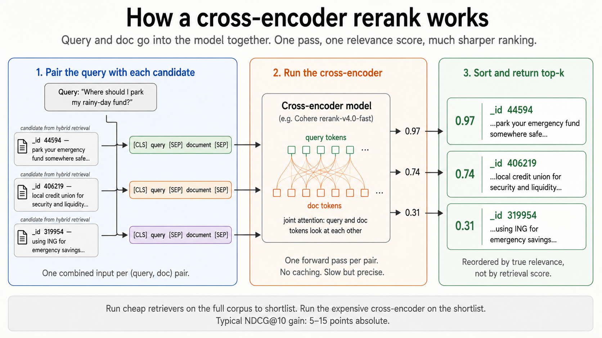
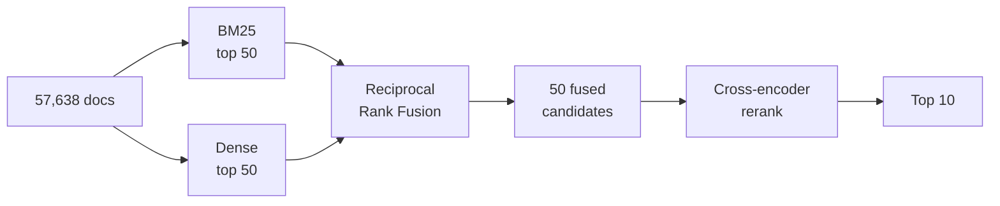

# How reranking works (and why it's a separate step)

After RRF, you have a fused list of, say, 50 candidate documents that are all *plausibly* relevant. The reranker's job is to look at each one carefully against the query and reorder them so the *actually* relevant ones rise to the top. This doc is the minimum mental model you need to read [`5-rerank.py`](../5-rerank.py).

## The intuition in one sentence

> The retrievers find the candidates fast and cheap. The reranker reads each candidate against the query slowly and carefully, and reorders them by true relevance.

That's the whole two-stage retrieval pattern. Cast a wide net, then judge.

## What a reranker actually is



Dense retrieval from [`3-embed.py`](../3-embed.py) uses a **bi-encoder**: two separate passes through the encoder, one for the query and one for each doc, then compare the resulting vectors with cosine. Doc vectors get computed once and cached. Fast, but the query and the doc never see each other inside the model.

A reranker uses a **cross-encoder**: the query and one document get concatenated and fed into the model **together**, in a single pass, and the model emits one relevance score for that pair.

```
[CLS]  query  [SEP]  document  [SEP]  ──▶  encoder  ──▶  relevance score
```

Because the model sees both sides at once, its attention layers can match a question word in the query to the answering phrase in the doc, flip the meaning when there's a negation, and notice when the doc only *almost* answers the question. That's what bi-encoder cosine similarity can't do.

The trade-off is cost. Bi-encoder doc vectors are cached. Cross-encoder scores cannot be cached because every (query, doc) pair is new. You have to run the model on every pair at query time. So you cannot cross-encode all 57k docs per query, you cross-encode only the top 50 candidates that the cheap retrievers have already shortlisted.

## The two-stage retrieval pipeline



The numbers matter:

- **57k → 50** via BM25 + dense + RRF. Cheap and fast.
- **50 → 10** via cross-encoder. Expensive per item but only 50 items.

If you set `candidate_k` too low (say 10), the reranker has nothing to work with: the truly relevant doc might have been at rank 30, which never reached the reranker. Set it too high (say 500) and you pay the cross-encoder cost 10x for almost no gain, because the long tail is unlikely to contain anything the reranker can rescue. 50–100 is the standard sweet spot.

## What `5-rerank.py` is actually doing

The pipeline is short:

```python
def search_reranked(query: str, k: int = 10, candidate_k: int = 50):
    candidate_ids   = hybrid_candidates(query, candidate_k=candidate_k)
    candidate_texts = [corpus_by_id.loc[d, "text"] for d in candidate_ids]

    response = co.rerank(
        model="rerank-v4.0-fast",
        query=query,
        documents=candidate_texts,
        top_n=k,
    )

    return [(candidate_ids[r.index], r.relevance_score) for r in response.results]
```

Three steps:

1. **`hybrid_candidates(query, candidate_k=50)`** returns 50 doc IDs from BM25+dense+RRF.
2. **Look up the actual text** for those 50 IDs. The reranker needs to see the document, not just the ID.
3. **Send query + 50 doc texts to Cohere's rerank API.** It returns the top 10 reordered, each with a `relevance_score` in `[0, 1]`.

Cohere's API does all the cross-encoder work server-side. You pay per request (1 unit per ~100 docs reranked at the time of writing). Latency is typically 200–500ms for 50 docs.

## When reranking is worth it, when it isn't

**Worth it when:**
- Recall is good but precision-at-top-k matters. The retriever found the right doc at rank 12, you need it at rank 1.
- Queries are nuanced: questions, multi-clause queries, queries with negation or qualifiers.
- The downstream system can only process the top 3–5 results (e.g. an LLM with a small context budget).

**Not worth it when:**
- Your retriever already nails the task. Run an eval first. If NDCG@10 is already >0.9, reranking adds latency for little gain.
- Latency budget is brutal. A reranker call adds 200ms+ to every query.
- Cost matters at scale. Cohere/Voyage charge per request. For high-QPS systems this becomes the dominant infra line item.

Typical improvement from adding a cross-encoder reranker on top of a hybrid baseline on academic benchmarks: **5–15 NDCG@10 points absolute.** On FiQA, you'll see this in [`6-evaluate.py`](../6-evaluate.py).

## Local vs API rerankers

| Model                                | Where it runs | Strength                                                                |
| ------------------------------------ | ------------- | ----------------------------------------------------------------------- |
| **Cohere `rerank-v4.0-fast`**        | API           | Strong out of the box, multilingual. What this tutorial uses.           |
| **Cohere `rerank-v4.0`**             | API           | Slower than `-fast`, slightly better quality.                           |
| **Voyage `rerank-2.5-lite`**         | API           | Competitive with Cohere, sometimes better on technical content.         |
| **BAAI `bge-reranker-v2-m3`**        | Local         | Strongest open-weight option, ~568MB. CPU-runnable for tutorial scale.  |
| **Cross-encoder `ms-marco-MiniLM-L-6-v2`** | Local   | Tiny (~80MB), fast on CPU, the classic sentence-transformers default.   |

The swap is one function. If you replace `co.rerank(...)` with `bge_reranker.compute_scores([(query, d) for d in candidate_texts])` and sort by the resulting scores, you have a fully-local pipeline. Latency goes up (running a 568MB model on CPU is not free), but you stop paying per-query.

## Further reading

- Cohere rerank overview: [docs.cohere.com/docs/rerank-overview](https://docs.cohere.com/docs/rerank-overview)
- The original cross-encoder vs bi-encoder framing: Reimers & Gurevych, *Sentence-BERT* (2019). Section 3 explains the trade-off clearly: [arxiv.org/abs/1908.10084](https://arxiv.org/abs/1908.10084)
- BGE reranker: [huggingface.co/BAAI/bge-reranker-v2-m3](https://huggingface.co/BAAI/bge-reranker-v2-m3)
- MS MARCO reranking benchmark: [microsoft.github.io/msmarco](https://microsoft.github.io/msmarco/)
