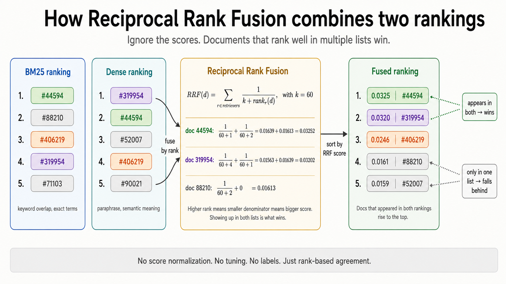

# How Reciprocal Rank Fusion combines two rankings into one

BM25 gives you one ranked list. Dense retrieval gives you another. Some docs appear in both, some appear in only one, the scores live on completely different scales. RRF is the boring, one-line algorithm that fuses them into a single ranked list that almost always beats either alone. This doc is the minimum mental model you need to read [`4-rrf.py`](../4-rrf.py).

## The intuition in one sentence

> Ignore the scores. Look at where each document **ranks** in each list, and give documents that show up near the top of multiple lists the highest combined score.

## Why you can't just average the scores

The first thing most people try is `final_score = w * bm25_score + (1 - w) * cosine_score`. It doesn't work, and the reason is that the two scores live on incomparable scales:

| Retriever | Score range          | Behavior                                            |
| --------- | -------------------- | --------------------------------------------------- |
| BM25      | $[0, \infty)$, unbounded | Depends on query length, corpus size, term rarity. |
| Cosine    | $[-1, 1]$, bounded   | Always between 0 and 1 in practice for text.        |

A "good" BM25 score on a 5-term query might be 18.5. A "good" cosine score is 0.78. Averaging them means BM25 dominates the fusion by a factor of ~25 for no semantic reason. You can normalize each retriever's scores to $[0, 1]$ and average those, but the normalization is brittle: it depends on which docs happened to score highest in this particular query, not on any stable property of the retriever.

RRF sidesteps the whole problem by **throwing the scores away** and using only the **rank** (position 1, 2, 3, ...) within each list.

## The formula



For a document $d$ and a set of ranked retriever outputs $R = \{r_1, r_2, \ldots\}$:

$$
\text{RRF}(d) = \sum_{r \in R} \frac{1}{k + \text{rank}_r(d)}
$$

| Symbol            | What it means                                                                                  |
| ----------------- | ---------------------------------------------------------------------------------------------- |
| $\text{rank}_r(d)$ | The 1-indexed position of $d$ in retriever $r$'s ranked list. Rank 1 is the top result.       |
| $k$               | A smoothing constant. The Cormack et al. 2009 paper sets $k = 60$ and most libraries copied that. |

If a document is **not in** retriever $r$'s top-K candidate list, its contribution from $r$ is just zero (treat the rank as infinity, or skip the term).

A concrete example for a single document $d$ that ranks #2 in BM25 and #5 in dense, with $k = 60$:

$$
\text{RRF}(d) = \frac{1}{60 + 2} + \frac{1}{60 + 5} = \frac{1}{62} + \frac{1}{65} \approx 0.0315
$$

A document that ranks #1 in BM25 but doesn't appear in the dense top-K:

$$
\text{RRF}(d) = \frac{1}{60 + 1} \approx 0.0164
$$

The doc that hit both retrievers wins, even though it never reached #1 in either. **That's the whole magic.** Documents that look good to multiple, independent retrievers get rewarded for the agreement.

## Why $k = 60$?

The original 2009 paper tried a range of values on TREC data and reported that $k = 60$ worked well. It's been the default ever since. The intuition for what $k$ controls:

- **Small $k$** (say, $k = 1$): the very top ranks dominate. Rank #1 is worth $\frac{1}{2}$, rank #10 is worth $\frac{1}{11}$, a 5.5x gap. Agreement matters less, individual top hits matter more.
- **Large $k$** (say, $k = 1000$): all ranks contribute roughly equally. Rank #1 is worth $\frac{1}{1001}$, rank #10 is worth $\frac{1}{1010}$, almost identical. Top hits stop mattering, the algorithm just counts how many lists each doc appears in.
- **$k = 60$**: a middle ground. Top hits get meaningful weight, but agreement across lists still pays off.

You almost never need to tune it. Microsoft's research search team, Elasticsearch's hybrid retrieval, and most production stacks all ship $k = 60$.

## What `4-rrf.py` is actually doing

The whole algorithm fits in 8 lines:

```python
from collections import defaultdict

def reciprocal_rank_fusion(rankings: list[list[str]], k: int = 60):
    scores = defaultdict(float)
    for ranking in rankings:
        for rank, doc_id in enumerate(ranking, start=1):
            scores[doc_id] += 1.0 / (k + rank)
    return sorted(scores.items(), key=lambda x: -x[1])
```

Notice what it does **not** do:

- No score normalization.
- No retriever weighting.
- No learned model.
- No mention of what BM25 or cosine even are.

The function takes "any number of ranked lists of doc IDs" and returns "one ranked list of doc IDs." You could fuse 5 retrievers, or 10, the loop doesn't care.

The calling code in `search_hybrid()` does the rest:

```python
bm25_ids  = [doc_id for doc_id, _ in bm25.search(query, k=50)]
dense_ids = [doc_id for doc_id, _ in dense.search(query, k=50)]
return reciprocal_rank_fusion([bm25_ids, dense_ids])[:10]
```

Pull the top 50 candidates from each retriever, fuse, return the top 10. The `candidate_k=50` matters: if you only fuse top-10 from each, you lose docs that one retriever ranked #15 but the other ranked #2. The standard practice is to over-fetch (50–100 per retriever) and then trim after fusion.

## When RRF is great, when it isn't

**Great at:**
- Combining retrievers with **incomparable score scales** (the BM25 + dense case, which is most hybrid setups).
- Zero-shot fusion with **no tuning** needed.
- Robustness: one bad retriever degrades quality gracefully, doesn't blow up the fusion.

**Less great at:**
- Cases where you *do* trust the score magnitudes and they live on the same scale. Then a weighted score average can beat RRF by a few NDCG points.
- Very small candidate pools. If you only fuse top-5 from each retriever, the rank signal is too coarse.
- Multi-stage pipelines where you want a calibrated probability of relevance, not a ranking. RRF outputs are not probabilities.

## Further reading

- Cormack, Clarke, & Büttcher, *Reciprocal Rank Fusion Outperforms Condorcet and Individual Rank Learning Methods* (SIGIR 2009). The original paper that introduced RRF and tested it on TREC: [PDF](https://plg.uwaterloo.ca/~gvcormac/cormacksigir09-rrf.pdf).
- Elasticsearch hybrid search docs (which use RRF with $k=60$ by default): [elastic.co/guide/en/elasticsearch/reference/current/rrf.html](https://www.elastic.co/guide/en/elasticsearch/reference/current/rrf.html).
